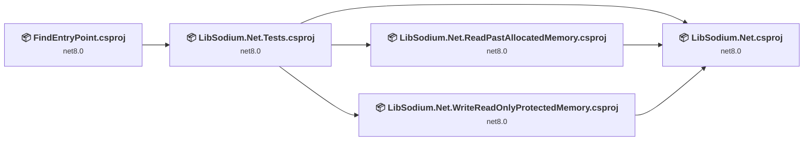
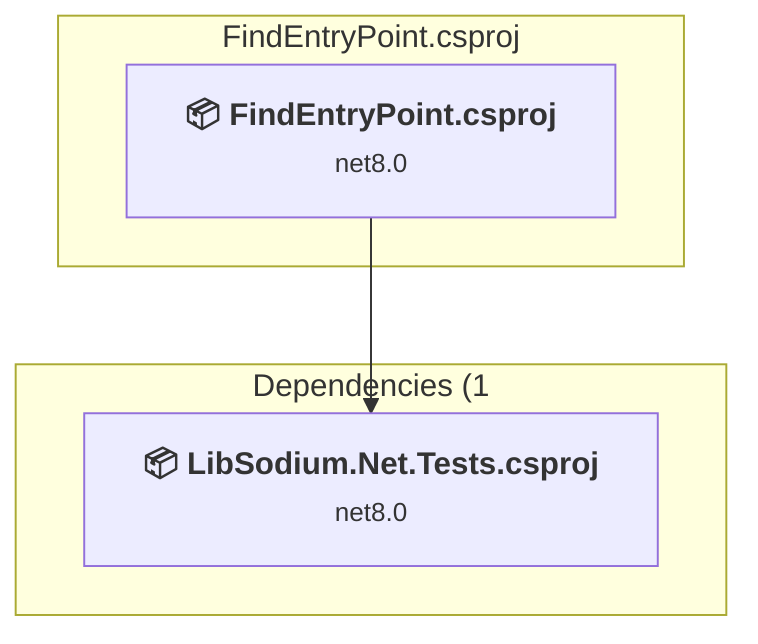
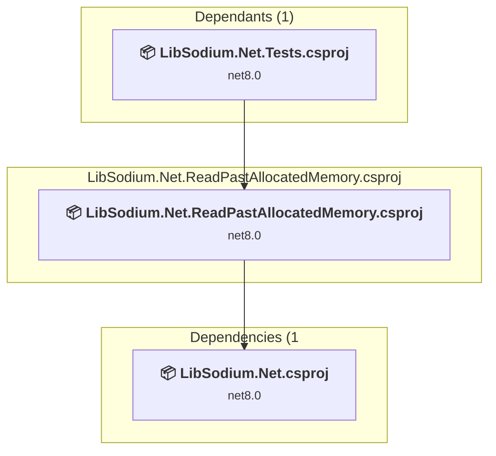
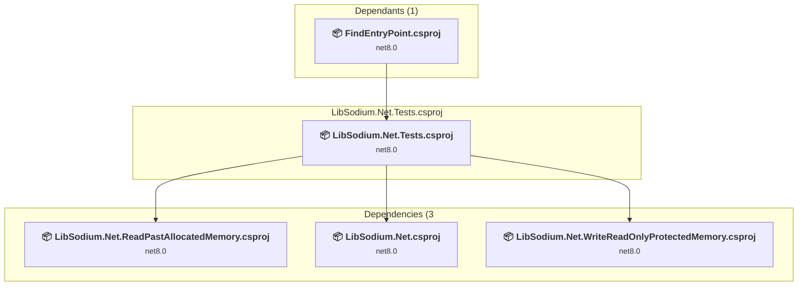
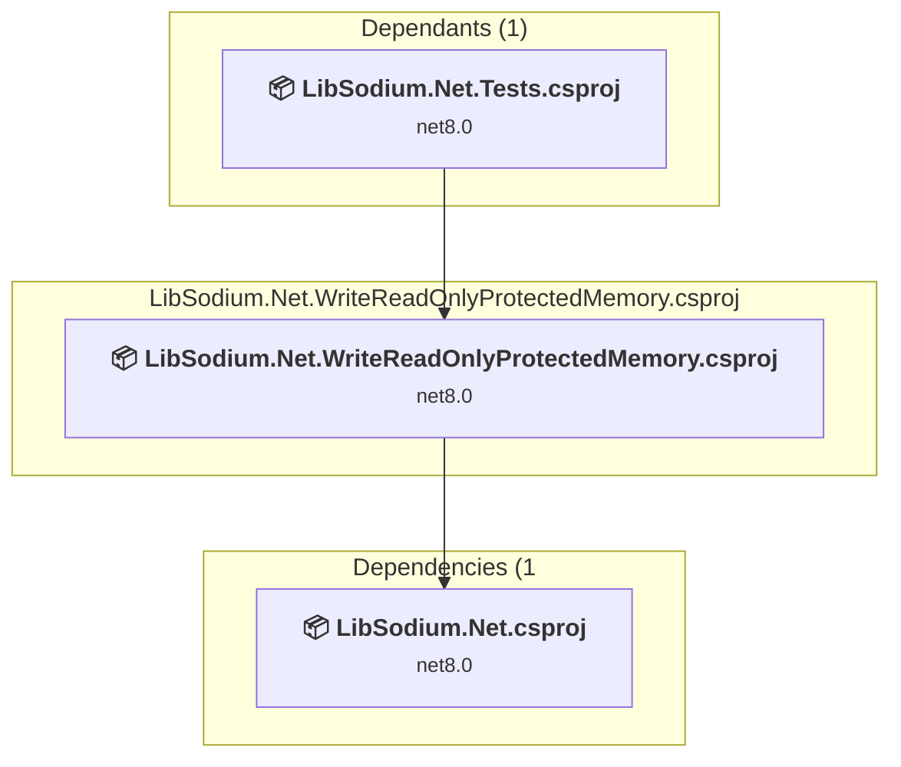
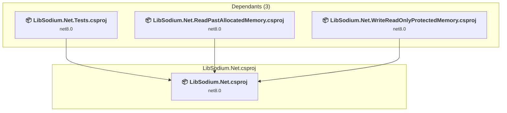

# Projects and dependencies analysis

This document provides a comprehensive overview of the projects and their dependencies in the context of upgrading to .NETCoreApp,Version=v10.0.

## Table of Contents

- [Executive Summary](#executive-Summary)
  - [Highlevel Metrics](#highlevel-metrics)
  - [Projects Compatibility](#projects-compatibility)
  - [Package Compatibility](#package-compatibility)
  - [API Compatibility](#api-compatibility)
  - [Binding Redirect Configuration](#binding-redirect-configuration)
- [Aggregate NuGet packages details](#aggregate-nuget-packages-details)
- [Top API Migration Challenges](#top-api-migration-challenges)
  - [Technologies and Features](#technologies-and-features)
  - [Most Frequent API Issues](#most-frequent-api-issues)
- [Projects Relationship Graph](#projects-relationship-graph)
- [Project Details](#project-details)

  - [FindEntryPoint\FindEntryPoint.csproj](#findentrypointfindentrypointcsproj)
  - [LibSodium.Net.ReadPastAllocatedMemory\LibSodium.Net.ReadPastAllocatedMemory.csproj](#libsodiumnetreadpastallocatedmemorylibsodiumnetreadpastallocatedmemorycsproj)
  - [LibSodium.Net.Tests\LibSodium.Net.Tests.csproj](#libsodiumnettestslibsodiumnettestscsproj)
  - [LibSodium.Net.WriteReadOnlyProtectedMemory\LibSodium.Net.WriteReadOnlyProtectedMemory.csproj](#libsodiumnetwritereadonlyprotectedmemorylibsodiumnetwritereadonlyprotectedmemorycsproj)
  - [LibSodium.Net\LibSodium.Net.csproj](#libsodiumnetlibsodiumnetcsproj)

## Executive Summary

### Highlevel Metrics

| Metric | Count | Status |
| :--- | :---: | :--- |
| Total Projects | 5 | All require upgrade |
| Total NuGet Packages | 19 | All compatible |
| Total Code Files | 137 |  |
| Total Code Files with Incidents | 5 |  |
| Total Lines of Code | 23469 |  |
| Total Number of Issues | 6 |  |
| Estimated LOC to modify | 0+ | at least 0,0% of codebase |

### Projects Compatibility

| Project | Target Framework | Difficulty | Package Issues | API Issues | Binding Issues | Est. LOC Impact | Description |
| :--- | :---: | :---: | :---: | :---: | :---: | :---: | :--- |
| [FindEntryPoint\FindEntryPoint.csproj](#findentrypointfindentrypointcsproj) | net8.0 | 🟢 Low | 0 | 0 | 0 |  | DotNetCoreApp, Sdk Style = True |
| [LibSodium.Net.ReadPastAllocatedMemory\LibSodium.Net.ReadPastAllocatedMemory.csproj](#libsodiumnetreadpastallocatedmemorylibsodiumnetreadpastallocatedmemorycsproj) | net8.0 | 🟢 Low | 0 | 0 | 0 |  | DotNetCoreApp, Sdk Style = True |
| [LibSodium.Net.Tests\LibSodium.Net.Tests.csproj](#libsodiumnettestslibsodiumnettestscsproj) | net8.0 | 🟢 Low | 0 | 0 | 0 |  | DotNetCoreApp, Sdk Style = True |
| [LibSodium.Net.WriteReadOnlyProtectedMemory\LibSodium.Net.WriteReadOnlyProtectedMemory.csproj](#libsodiumnetwritereadonlyprotectedmemorylibsodiumnetwritereadonlyprotectedmemorycsproj) | net8.0 | 🟢 Low | 0 | 0 | 0 |  | DotNetCoreApp, Sdk Style = True |
| [LibSodium.Net\LibSodium.Net.csproj](#libsodiumnetlibsodiumnetcsproj) | net8.0 | 🟢 Low | 1 | 0 | 0 |  | ClassLibrary, Sdk Style = True |

### Package Compatibility

| Status | Count | Percentage |
| :--- | :---: | :---: |
| ✅ Compatible | 19 | 100,0% |
| ⚠️ Incompatible | 0 | 0,0% |
| 🔄 Upgrade Recommended | 0 | 0,0% |
| ***Total NuGet Packages*** | ***19*** | ***100%*** |

### API Compatibility

| Category | Count | Impact |
| :--- | :---: | :--- |
| 🔴 Binary Incompatible | 0 | High - Require code changes |
| 🟡 Source Incompatible | 0 | Medium - Needs re-compilation and potential conflicting API error fixing |
| 🔵 Behavioral change | 0 | Low - Behavioral changes that may require testing at runtime |
| ✅ Compatible | 106134 |  |
| ***Total APIs Analyzed*** | ***106134*** |  |

## Aggregate NuGet packages details

| Package | Current Version | Suggested Version | Projects | Description |
| :--- | :---: | :---: | :--- | :--- |
| EnumerableAsyncProcessor | 2.1.0 |  | [FindEntryPoint.csproj](#findentrypointfindentrypointcsproj) [LibSodium.Net.Tests.csproj](#libsodiumnettestslibsodiumnettestscsproj) | ✅Compatible |
| libsodium | 1.0.20.1 |  | [FindEntryPoint.csproj](#findentrypointfindentrypointcsproj) [LibSodium.Net.csproj](#libsodiumnetlibsodiumnetcsproj) [LibSodium.Net.ReadPastAllocatedMemory.csproj](#libsodiumnetreadpastallocatedmemorylibsodiumnetreadpastallocatedmemorycsproj) [LibSodium.Net.Tests.csproj](#libsodiumnettestslibsodiumnettestscsproj) [LibSodium.Net.WriteReadOnlyProtectedMemory.csproj](#libsodiumnetwritereadonlyprotectedmemorylibsodiumnetwritereadonlyprotectedmemorycsproj) | ✅Compatible |
| Microsoft.DiaSymReader | 2.0.0 |  | [FindEntryPoint.csproj](#findentrypointfindentrypointcsproj) [LibSodium.Net.Tests.csproj](#libsodiumnettestslibsodiumnettestscsproj) | ✅Compatible |
| Microsoft.Extensions.DependencyModel | 6.0.2 |  | [FindEntryPoint.csproj](#findentrypointfindentrypointcsproj) [LibSodium.Net.Tests.csproj](#libsodiumnettestslibsodiumnettestscsproj) | ✅Compatible |
| Microsoft.Testing.Extensions.CodeCoverage | 17.14.2 |  | [FindEntryPoint.csproj](#findentrypointfindentrypointcsproj) [LibSodium.Net.Tests.csproj](#libsodiumnettestslibsodiumnettestscsproj) | ✅Compatible |
| Microsoft.Testing.Extensions.TrxReport.Abstractions | 1.6.3 |  | [FindEntryPoint.csproj](#findentrypointfindentrypointcsproj) [LibSodium.Net.Tests.csproj](#libsodiumnettestslibsodiumnettestscsproj) | ✅Compatible |
| Microsoft.Testing.Platform | 1.6.3 |  | [FindEntryPoint.csproj](#findentrypointfindentrypointcsproj) [LibSodium.Net.Tests.csproj](#libsodiumnettestslibsodiumnettestscsproj) | ✅Compatible |
| Microsoft.Testing.Platform.MSBuild | 1.4.3 |  | [FindEntryPoint.csproj](#findentrypointfindentrypointcsproj) [LibSodium.Net.Tests.csproj](#libsodiumnettestslibsodiumnettestscsproj) | ✅Compatible |
| System.Buffers | 4.5.1 |  | [FindEntryPoint.csproj](#findentrypointfindentrypointcsproj) [LibSodium.Net.Tests.csproj](#libsodiumnettestslibsodiumnettestscsproj) | ✅Compatible |
| System.Collections.Immutable | 8.0.0 |  | [FindEntryPoint.csproj](#findentrypointfindentrypointcsproj) [LibSodium.Net.Tests.csproj](#libsodiumnettestslibsodiumnettestscsproj) | ✅Compatible |
| System.Memory | 4.6.0 |  | [FindEntryPoint.csproj](#findentrypointfindentrypointcsproj) [LibSodium.Net.csproj](#libsodiumnetlibsodiumnetcsproj) [LibSodium.Net.ReadPastAllocatedMemory.csproj](#libsodiumnetreadpastallocatedmemorylibsodiumnetreadpastallocatedmemorycsproj) [LibSodium.Net.Tests.csproj](#libsodiumnettestslibsodiumnettestscsproj) [LibSodium.Net.WriteReadOnlyProtectedMemory.csproj](#libsodiumnetwritereadonlyprotectedmemorylibsodiumnetwritereadonlyprotectedmemorycsproj) | NuGet package functionality is included with framework reference |
| System.Reflection.Metadata | 8.0.0 |  | [FindEntryPoint.csproj](#findentrypointfindentrypointcsproj) [LibSodium.Net.Tests.csproj](#libsodiumnettestslibsodiumnettestscsproj) | ✅Compatible |
| System.Runtime.CompilerServices.Unsafe | 6.0.0 |  | [FindEntryPoint.csproj](#findentrypointfindentrypointcsproj) [LibSodium.Net.Tests.csproj](#libsodiumnettestslibsodiumnettestscsproj) | ✅Compatible |
| System.Text.Encodings.Web | 6.0.1 |  | [FindEntryPoint.csproj](#findentrypointfindentrypointcsproj) [LibSodium.Net.Tests.csproj](#libsodiumnettestslibsodiumnettestscsproj) | ✅Compatible |
| System.Text.Json | 6.0.11 |  | [FindEntryPoint.csproj](#findentrypointfindentrypointcsproj) [LibSodium.Net.Tests.csproj](#libsodiumnettestslibsodiumnettestscsproj) | ✅Compatible |
| TUnit | 0.19.143 |  | [FindEntryPoint.csproj](#findentrypointfindentrypointcsproj) [LibSodium.Net.Tests.csproj](#libsodiumnettestslibsodiumnettestscsproj) | ✅Compatible |
| TUnit.Assertions | 0.19.143 |  | [FindEntryPoint.csproj](#findentrypointfindentrypointcsproj) [LibSodium.Net.Tests.csproj](#libsodiumnettestslibsodiumnettestscsproj) | ✅Compatible |
| TUnit.Core | 0.19.143 |  | [FindEntryPoint.csproj](#findentrypointfindentrypointcsproj) [LibSodium.Net.Tests.csproj](#libsodiumnettestslibsodiumnettestscsproj) | ✅Compatible |
| TUnit.Engine | 0.19.143 |  | [FindEntryPoint.csproj](#findentrypointfindentrypointcsproj) [LibSodium.Net.Tests.csproj](#libsodiumnettestslibsodiumnettestscsproj) | ✅Compatible |

## Top API Migration Challenges

### Technologies and Features

| Technology | Issues | Percentage | Migration Path |
| :--- | :---: | :---: | :--- |

### Most Frequent API Issues

| API | Count | Percentage | Category |
| :--- | :---: | :---: | :--- |

## Projects Relationship Graph

Legend:
📦 SDK-style project
⚙️ Classic project

## Project Details

### FindEntryPoint\FindEntryPoint.csproj

#### Project Info

- **Current Target Framework:** net8.0
- **Proposed Target Framework:** net10.0
- **SDK-style**: True
- **Project Kind:** DotNetCoreApp
- **Dependencies**: 1
- **Dependants**: 0
- **Number of Files**: 1
- **Number of Files with Incidents**: 1
- **Lines of Code**: 16
- **Estimated LOC to modify**: 0+ (at least 0,0% of the project)

#### Dependency Graph

Legend:
📦 SDK-style project
⚙️ Classic project

### API Compatibility

| Category | Count | Impact |
| :--- | :---: | :--- |
| 🔴 Binary Incompatible | 0 | High - Require code changes |
| 🟡 Source Incompatible | 0 | Medium - Needs re-compilation and potential conflicting API error fixing |
| 🔵 Behavioral change | 0 | Low - Behavioral changes that may require testing at runtime |
| ✅ Compatible | 142 |  |
| ***Total APIs Analyzed*** | ***142*** |  |

### LibSodium.Net.ReadPastAllocatedMemory\LibSodium.Net.ReadPastAllocatedMemory.csproj

#### Project Info

- **Current Target Framework:** net8.0
- **Proposed Target Framework:** net10.0
- **SDK-style**: True
- **Project Kind:** DotNetCoreApp
- **Dependencies**: 1
- **Dependants**: 1
- **Number of Files**: 1
- **Number of Files with Incidents**: 1
- **Lines of Code**: 26
- **Estimated LOC to modify**: 0+ (at least 0,0% of the project)

#### Dependency Graph

Legend:
📦 SDK-style project
⚙️ Classic project

### API Compatibility

| Category | Count | Impact |
| :--- | :---: | :--- |
| 🔴 Binary Incompatible | 0 | High - Require code changes |
| 🟡 Source Incompatible | 0 | Medium - Needs re-compilation and potential conflicting API error fixing |
| 🔵 Behavioral change | 0 | Low - Behavioral changes that may require testing at runtime |
| ✅ Compatible | 3 |  |
| ***Total APIs Analyzed*** | ***3*** |  |

### LibSodium.Net.Tests\LibSodium.Net.Tests.csproj

#### Project Info

- **Current Target Framework:** net8.0
- **Proposed Target Framework:** net10.0
- **SDK-style**: True
- **Project Kind:** DotNetCoreApp
- **Dependencies**: 3
- **Dependants**: 1
- **Number of Files**: 36
- **Number of Files with Incidents**: 1
- **Lines of Code**: 9799
- **Estimated LOC to modify**: 0+ (at least 0,0% of the project)

#### Dependency Graph

Legend:
📦 SDK-style project
⚙️ Classic project

### API Compatibility

| Category | Count | Impact |
| :--- | :---: | :--- |
| 🔴 Binary Incompatible | 0 | High - Require code changes |
| 🟡 Source Incompatible | 0 | Medium - Needs re-compilation and potential conflicting API error fixing |
| 🔵 Behavioral change | 0 | Low - Behavioral changes that may require testing at runtime |
| ✅ Compatible | 96732 |  |
| ***Total APIs Analyzed*** | ***96732*** |  |

### LibSodium.Net.WriteReadOnlyProtectedMemory\LibSodium.Net.WriteReadOnlyProtectedMemory.csproj

#### Project Info

- **Current Target Framework:** net8.0
- **Proposed Target Framework:** net10.0
- **SDK-style**: True
- **Project Kind:** DotNetCoreApp
- **Dependencies**: 1
- **Dependants**: 1
- **Number of Files**: 1
- **Number of Files with Incidents**: 1
- **Lines of Code**: 14
- **Estimated LOC to modify**: 0+ (at least 0,0% of the project)

#### Dependency Graph

Legend:
📦 SDK-style project
⚙️ Classic project

### API Compatibility

| Category | Count | Impact |
| :--- | :---: | :--- |
| 🔴 Binary Incompatible | 0 | High - Require code changes |
| 🟡 Source Incompatible | 0 | Medium - Needs re-compilation and potential conflicting API error fixing |
| 🔵 Behavioral change | 0 | Low - Behavioral changes that may require testing at runtime |
| ✅ Compatible | 5 |  |
| ***Total APIs Analyzed*** | ***5*** |  |

### LibSodium.Net\LibSodium.Net.csproj

#### Project Info

- **Current Target Framework:** net8.0
- **Proposed Target Framework:** net10.0
- **SDK-style**: True
- **Project Kind:** ClassLibrary
- **Dependencies**: 0
- **Dependants**: 3
- **Number of Files**: 98
- **Number of Files with Incidents**: 1
- **Lines of Code**: 13614
- **Estimated LOC to modify**: 0+ (at least 0,0% of the project)

#### Dependency Graph

Legend:
📦 SDK-style project
⚙️ Classic project

### API Compatibility

| Category | Count | Impact |
| :--- | :---: | :--- |
| 🔴 Binary Incompatible | 0 | High - Require code changes |
| 🟡 Source Incompatible | 0 | Medium - Needs re-compilation and potential conflicting API error fixing |
| 🔵 Behavioral change | 0 | Low - Behavioral changes that may require testing at runtime |
| ✅ Compatible | 9252 |  |
| ***Total APIs Analyzed*** | ***9252*** |  |

